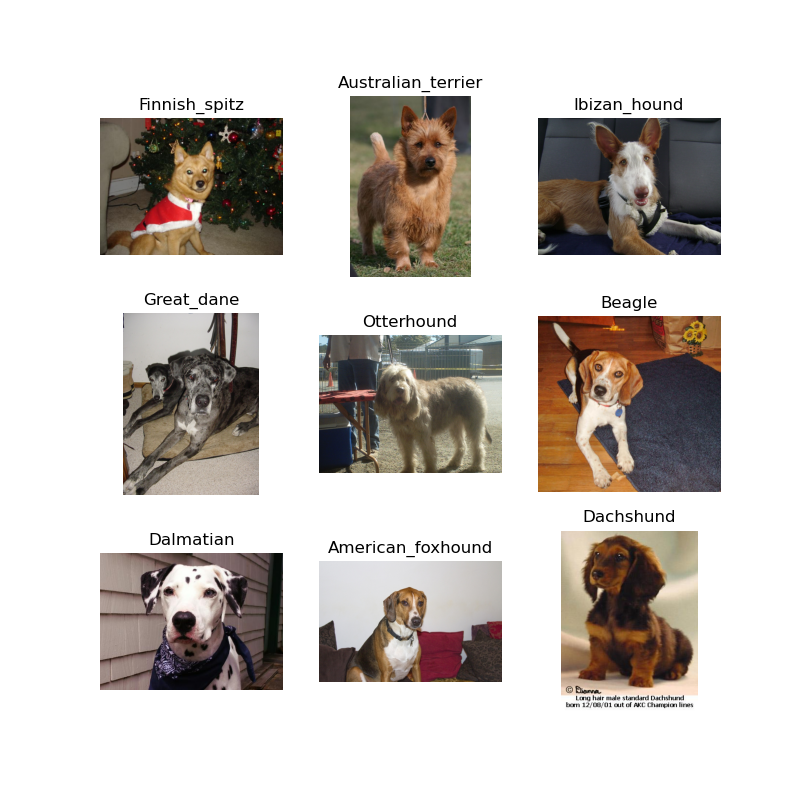
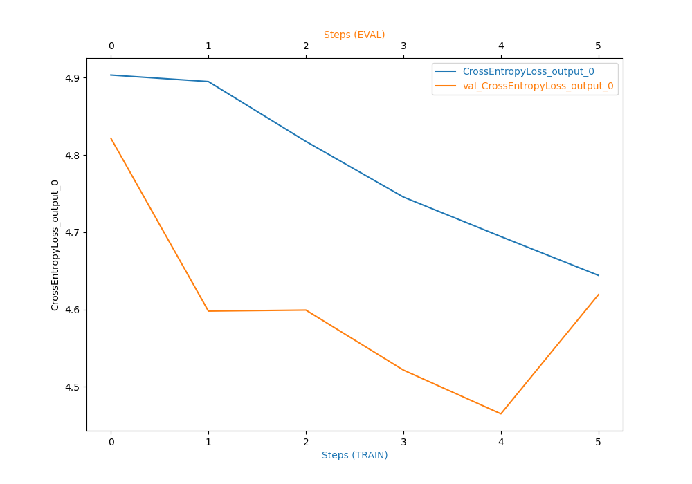

# Project: Image Classification (Deep Learning) using AWS SageMaker

A program requirement for AWS Machine Learning Engineer Nanodegree @ Udacity School of Artificial Intelligence

## Project Description

Used AWS Sagemaker to train and deploy a pretrained deep learning model (Resnet50) that can perform image classification. Employed good ML engineering practices by using the Sagemaker profiling, debugger, hyperparameter tuning and others.

## Project Set Up and Installation

The project was completed on AWS Sagemaker through the cloud gateway provided by the course. You can use your personal account for that. AWS costs of this training should be less than 5 USD and will take around a day to complete (tuning and training).

## Dataset

The provided dataset is the dogbreed classification dataset which can be found here: https://s3-us-west-1.amazonaws.com/udacity-aind/dog-project/dogImages.zip
There are 133 total dog categories. Sample dataset images shown below:

### Access

The dataset was uploaded to S3 bucket through the AWS Gateway so that SageMaker has access to the data. 

## Hyperparameter Tuning

I chose pretrained resnet50 model, because it is well suited for image classification tasks. Hyperparameter tuning was done with sctipt hpo.py. 

Two hyperparameters were tuned:

learning rate - to find when the model learns fasters without overfitting

batch-size - to find an optimal batch size to optimize model training time

Hyperparameter tuning ranges:
Learning rate was tuned for range: 0.001, 0.1 - found optimal value is 0.0015249791503711243..
Batch size was tuned for values: {32, 64, 128, 256, 512} - found optimal value is 256.

Hyperparameter tuning job

## Debugging and Profiling

Model debugging and profling is embedded in the script: train_model.py. multiple rules for debugger and profiller were created in the notebook. Training used 20% of the dataset images. Ideally this training should use 100% of the dataset, but then the job would take too long. 

The best parameters from hyperparameter tuning are:

learning rate = 0.0015249791503711243
batch size = 256

### Results

Learning parameters appears to decreased over time as seen below:

## Model Deployment

Additional entrypoint for Sagemaker to load and preprocess image was needed to deploy model. This is done in the inference.py file. Example of preprocessing procedure and endpoint invocation is done on a test image (Anatolian_shepherd_dog_00690.jpg) in jupyter Notebook. The trained model return correct results for the test image.

A screenshot of the deployed active endpoint in Sagemaker.

